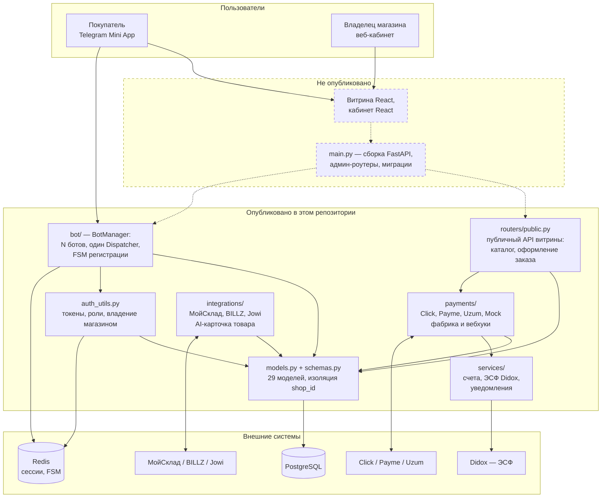

# Grammerce — выборка исходного кода

Платформа, которая превращает Telegram-бота в готовый интернет-магазин: витрина,
приём заказов, оплата и кабинет владельца — без разработки и без своего сервера.
Работает в Узбекистане, обслуживает магазины реальных клиентов.

> ### Что это за репозиторий
>
> **Это выборка модулей коммерческого продукта, опубликованная для оценки
> в рамках President Tech Award 2026. Это не весь код и не работающее
> приложение.**
>
> Здесь опубликован серверный домен: платежи, интеграции с кассами, модели
> данных, авторизация, Telegram-боты и публичный API витрины. **Не опубликованы**
> сборка приложения (`main.py`), веб-кабинет владельца, фронтенд витрины,
> админ-роутеры, миграции базы и инфраструктура развёртывания.
>
> Собрать и запустить продукт из этого репозитория нельзя — и такой цели нет.
> Цель — показать, как написан код: архитектура мульти-тенантности, работа
> с деньгами, обработка вебхуков платёжных провайдеров и тесты к этому всему.
> Тесты в репозитории настоящие и проходят: `pytest tests/ -q` — 265 зелёных.
>
> Основной репозиторий проекта закрыт. Условия использования — в [LICENSE](LICENSE).

## Задача

Малому бизнесу в Узбекистане нужен канал продаж, а не сайт. Клиенты уже сидят
в Telegram, но у продавца там только переписка: заказы теряются в диалогах,
остатки живут в тетради, оплату принимают переводом на карту.

Grammerce разворачивает магазин целиком внутри Telegram: покупатель открывает
витрину как Mini App, оформляет заказ и платит через Click, Payme или Uzum;
владелец видит заказ в веб-кабинете, а остатки при желании синхронизируются
с его кассой (МойСклад, BILLZ, Jowi). Один сервер обслуживает произвольное
число магазинов — каждый со своим ботом, витриной и данными.

## Архитектура

Сплошным контуром — то, что есть в этом репозитории; пунктиром — то, что
осталось в закрытой части.



Мульти-тенантность построена на сквозном `shop_id`: он есть у каждой бизнес-
сущности, каждый запрос фильтруется по нему, а admin-эндпоинты дополнительно
проверяют, что обращающийся — владелец именно этого магазина
(`auth_utils.verify_shop_owner`).

## Стек

| Слой | Технологии |
|---|---|
| Язык и фреймворк | Python 3.11, FastAPI, SQLAlchemy 2.0 (async), Pydantic v2 |
| Telegram | aiogram 3.x — один Dispatcher на все боты магазинов, FSM в Redis |
| Данные | PostgreSQL в проде, SQLite в тестах, Redis для сессий и FSM |
| Платежи | Click, Payme (JSON-RPC), Uzum + Mock-провайдер за общим интерфейсом |
| Учёт | МойСклад, BILLZ, Jowi; ЭСФ через Didox |

## Что смотреть в первую очередь

| Файл | Почему интересен |
|---|---|
| [`bot/manager.py`](bot/manager.py) | Мульти-ботовость: N ботов магазинов на одном процессе и одном Dispatcher, семафор на 200 одновременных апдейтов |
| [`payments/factory.py`](payments/factory.py) | Выбор платёжного шлюза по настройкам магазина; без ключей магазин продолжает принимать заказы через Mock, а не падает |
| [`payments/payme_gateway.py`](payments/payme_gateway.py) | Payme работает по JSON-RPC, а не REST — отсюда отдельный формат ответа и своя схема ошибок |
| [`payments/router.py`](payments/router.py) | Вебхуки трёх провайдеров: проверка подписи, идемпотентность повторных колбэков, разделение состояний заказа и платежа |
| [`routers/public.py`](routers/public.py) | Оформление заказа: цена берётся из каталога, а не из тела запроса; товар обязан принадлежать этому магазину; статус заказа не отдаётся анониму |
| [`auth_utils.py`](auth_utils.py) | Двухуровневые роли: платформа и магазин; проверка владения магазином; хранение токенов в Redis с fallback в память |
| [`models.py`](models.py) | Доменная модель целиком: 29 таблиц, сквозной `shop_id`, снимок цены в позиции заказа |
| [`integrations/factory.py`](integrations/factory.py) | Адаптеры касс за одним интерфейсом; неготовый адаптер деградирует в mock с явным предупреждением в логе |

## Запуск тестов

```bash
python -m venv venv && source venv/bin/activate   # Windows: venv\Scripts\activate
pip install -r requirements.txt
pytest tests/ -q
```

265 тестов, все зелёные. Внешние сервисы не нужны: тесты работают на SQLite,
а платёжные провайдеры, кассы и Didox подменяются моками на уровне HTTP-клиента.

Тяжёлые зависимости AI-конвейера (`rembg`, `onnxruntime`, `google-genai`) вынесены
в `requirements-optional.txt`: код импортирует их лениво, внутри функций, и без
них модули поднимаются, а тесты проходят. Ставьте, только если нужно запускать
удаление фона и генерацию описаний:

```bash
pip install -r requirements.txt -r requirements-optional.txt
```

Проверка стиля — тем же конфигом, что и в основном репозитории:

```bash
ruff check .
```

## Структура

```
models.py           29 моделей SQLAlchemy: магазины, товары, заказы, платежи, роли
schemas.py          Pydantic-схемы запросов и ответов
auth_utils.py       токены, роли платформы и магазина, проверка владения
database.py         подключение к БД, зависимость get_db
config/             settings, billing, oauth — всё из переменных окружения
bot/                BotManager, handlers, middleware контекста магазина, i18n
payments/           Click, Payme, Uzum, Mock: общий интерфейс, фабрика, вебхуки
integrations/       POS-адаптеры, синхронизация каталога, AI-карточка товара
services/           счета и ЭСФ, уведомления, профиль покупателя
routers/            публичный API витрины
utils/              подпись Telegram initData, токены статуса заказа, i18n
tests/              16 файлов, 265 тестов
docs/               документация проекта по опубликованным слоям
```

## Документация

| Файл | О чём |
|---|---|
| [`docs/01_overview.md`](docs/01_overview.md) | Архитектура, мульти-тенантность, роли, переменные окружения |
| [`docs/04_backend.md`](docs/04_backend.md) | Приложение, роутеры, сервисы, платежи, бот |
| [`docs/05_database.md`](docs/05_database.md) | Таблицы, связи, соглашения схемы |

Документы написаны для всего продукта, поэтому упоминают и то, чего в этой
выборке нет.

## Лицензия

Проприетарная. Код опубликован **только для ознакомления и оценки**; любое
использование, копирование и распространение запрещено. Полный текст —
в [LICENSE](LICENSE).
